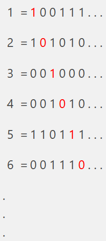

# Procedure

The experiment simulation shows an example of Cantor's diagonlization on binary numbers. It shows n strings among infinte binary strings of infinite length of which first n characters are visible. The n here is the window size which is based on user input and goes from 1 to 10 in integer values. Using the strings and their parts visible to use, we try to find a string dissimilar to all of them. we enter the resutling string in the area that appears in the simulation after generating the strings. we click check to check if the entered string is correct or not.

## Example

We now take an example run of the simulation:-

we enter 6 as the input in the window size and the following set of strings is oberved.

we flip the first bit $ 1 $ of first generated string and enter $ 0 $ in the answer field. we flip the second bit $ 0 $ of the second string and enter $ 1 $ in the answer field after the first bit. we repeat this process until all the bits highlighted in red are flipped. As we can see, the bits we flip appear to form a diagonal and the resulting binary string from their compliment comes out to be $ 010101 $.

clicking on check with our answer will provide us the a message saying "the answer is correct".